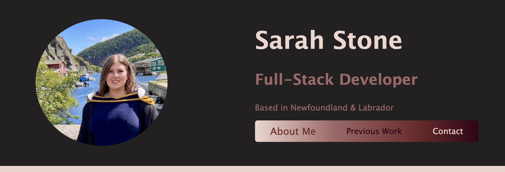
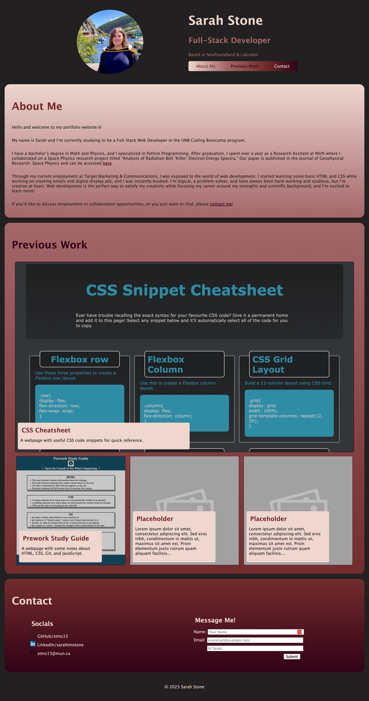

# Sarah Stone's Portfolio

## Description

This webpage is a personal portfolio showcasing the work I've done. You can browse my site to learn more about me, review my previous projects, and contact me.

The goal is to make my experience and expertise as a developer easily accessible, and to provide helpful links and information to those who want to reach out.

This website currently only uses HTML and CSS. While building, I learned more about flexboxes, hover actions, and responsive elements.

## Table of Contents

- [Installation](#installation)
- [Usage](#usage)
- [Credits](#credits)
- [License](#license)
- [Badges](#badges)

## Installation

N/A

## Usage

The webpage is hosted on GitHub Pages and can be accessed here: https://stms15.github.io/SarahStone-Portfolio/. 

The navigation bar in the header section can be used to quickly go to each section on the page. Hovering over one of the section names in the bar will cause the text to expand. When clicked, the page will scroll to the associated section.

You can learn more about me, my background, and my interests in the "About Me" section. The "Previous Work" section contains clickable screenshots of my current or past projects. When clicked, these will open the corresponding project in a new tab. You can find information on how to contact me directly or through my socials in the "Contact" section.

A screenshot of the entire website can be seen below.

## Credits

In the "Contact" section under "Socials," the GitHuib icon was obtained <a href="https://commons.wikimedia.org/wiki/File:Octicons-mark-github.svg" target="_blank">here</a>, the LinkedIn icon was obtained <a href="https://en.wikipedia.org/wiki/File:LinkedIn_icon.svg" target="_blank">here</a>, and the envelope icon was obtained <a href="https://www.svgrepo.com/svg/71404/envelope" target="_blank">here</a>.

W3 Schools was used to understand the proper use of <a href="https://www.w3schools.com/css/css_overflow.asp" taregt="_blank">overflow<a>, <a href="https://www.w3schools.com/css/css_image_transparency.asp" target="_blank">opacity</a>, <a href="https://www.w3schools.com/css/css3_transitions.asp" target="_blank">transitions</a>, and how to add a button and alter the style of <a href="https://www.w3schools.com/css/css_form.asp" target="_blank">forms</a>.

Additionally, <a href="https://stackoverflow.com/questions/37323619/second-media-query-not-working">this Stack Overflow thread</a> helped determine the solution required for the second media query to work on mobile devices. Specifying the wdith and size content of the meta "viewport" field fixed this issue.

## License

&copy; 2023 Sarah Stone

There is no license as use of the code is not currently permitted. If you wish to use some code, please contact me.

---

## Badges

